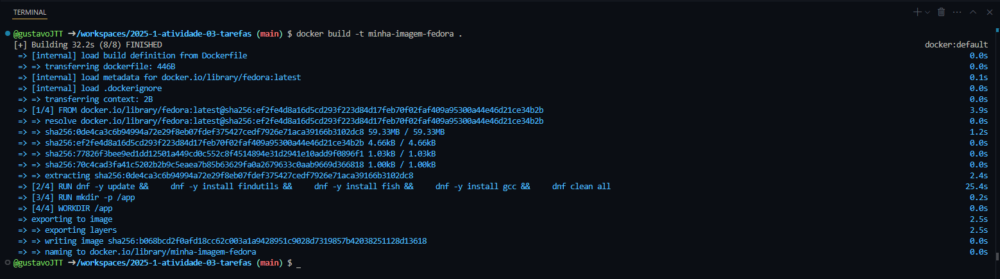
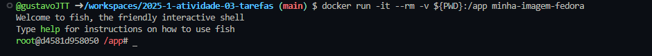
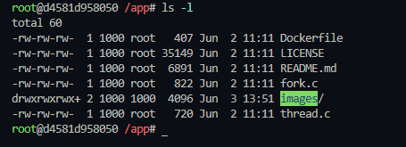
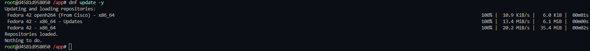
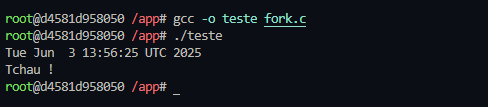
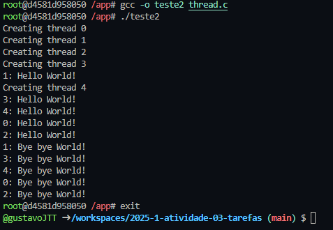

# Relatório de Atividade Prática com Linux no Docker

## Informações Gerais
- **Título:** Atividade 03 - Compilação de código dentro de docker fedora
- **Nome:** Gustavo José Teixeira Tavares
- **Data:** 05/06/2025

## Introdução

Este relatório documenta a realização da atividade prática de criação e utilização de um contêiner Docker baseado no Fedora para compilar e executar programas em C relacionados a processos e threads. O objetivo foi aplicar conceitos de sistemas operacionais, especificamente sobre implementação de tarefas (processos e threads) no sistema Linux.

## Relato das Atividades

### Criação dockerfile e build

Criei um Dockerfile conforme as instruções da atividade. O arquivo contém as configurações necessárias para criar uma imagem Docker baseada no Fedora com todas as ferramentas necessárias para compilação de código C. Pelo Dockerfile instalo o compilador GCC, além do Fish shell e findutils para facilitar o trabalho no ambiente Linux.

Após criar o Dockerfile, executei o comando para construir a imagem Docker. O processo de build baixou a imagem base do Fedora e instalou todos os pacotes que foram configurados no Dockerfile.

### Execução do conatainer

Executei o contêiner Docker usando o comando `docker run`, o terminal Fish foi iniciado automaticamente porque no dockerfile o fish está como shell padrão do container.

### Verificação de diretório

Nesta etapa executo o comando `ls -l` para verifica o que há no diretório `/app`, que foi criado e configurado no dockerfile como diretório parão de trabalho.

### Update e instalação gcc

Nessa etapa uso o comando `dnf update -y` para atualizar os pacotes existentes no momento, a execução do coomando para instalar o compilador gcc não é necessária porque no dockerfile ele é instalado como um processo secundário.

### Compilação e execução

Agora, compilei o arquivo `fork.c` utilizando o compilador gcc. Após a compilação executei o programa `teste` que criou um processo filho que executou o comando date, mostrando a data atual, enquanto o processo pai esperou a conclusão do filho antes de mostrar a mensagem "Tchau!".

Agora a execução do segundo programa `thread.c`, que é compilado da mesma forma que o programa anterior. Após a compilação executei o programa `teste2` que cria 5 threads com cada uma imprimindo "Hello World!" e depois de 5 segundos imprime "Bye bye World!".

## Conclusão

### O que aprendi?

Através da atividade, pude aprender alguns conceitos de paralelismo, com a execução de processos em segundo plano e alguns conceitos de threads e execuçao mpultipla de partes do programa em simultaniedade, além de aprender que no socker podemos executar programas normalmente e não só guardar arquivos e configurações.

### Dificuldades

A principal dificuldade foi entender o comportamento das threads, sendo algo que nunca tinha visto antes em forma de código, apenas sabia que tinha como fazer mas nunca havia testado.